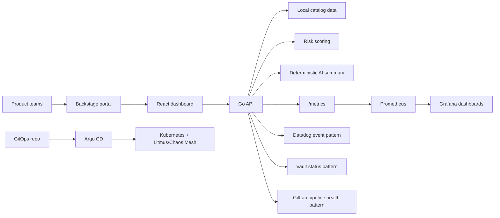

# Platform Chaos Reliability Hub

GitOps-driven chaos engineering, service risk scoring, runbooks, observability and developer enablement in one compact platform reference implementation.

## Problem

Chaos experiments are often stored as YAML, but product teams still struggle to answer practical questions:

- Which experiment is safe for my service?
- Who owns the blast radius and rollback?
- Are runbooks, dashboards and alerts good enough before we test?
- Did the experiment reduce Mean Time To Detect, or just create noise?

## Solution

Platform Chaos Reliability Hub wraps the original chaos playbook with a small Go API, a TypeScript developer dashboard, Backstage-compatible entry points, GitOps deployment assets, Azure reference infrastructure and observability guidance. It is designed to be demo-ready locally without cloud credentials while showing realistic platform engineering patterns for Azure, Kubernetes, Terraform, Ansible, Helm, GitHub Actions, GitLab, Vault, Datadog, Prometheus and Grafana.



## Features

- Go backend API for health, version, experiments, services, risk scoring, runbooks, integrations, AI summaries and Prometheus metrics.
- Deterministic risk scoring across blast radius, criticality, error rate, ownership, runbooks, observability, experiment history and security sensitivity.
- Local AI incident summary provider plus OpenAI/Azure OpenAI-compatible configuration placeholders.
- Vite React frontend with dashboard, experiment catalog, service risk, runbooks, integrations and developer portal views.
- Backstage catalog descriptor, service onboarding template, experiment template and plugin-style page skeleton.
- Terraform modules for Azure DevTest Lab, managed identities and observability workspace.
- Helm chart with backend/frontend deployments, services, ingress, config, service account, network policy and optional ServiceMonitor.
- Ansible bootstrap and secret rotation playbook scaffolds.
- GitHub Actions and GitLab CI examples for test, lint, security, Terraform, Helm and release workflows.
- Prometheus, Grafana, Datadog and alert examples focused on reducing MTTD.

## Screenshots

Run `make dev` and open [http://localhost:5173](http://localhost:5173). The frontend includes fallback demo data, so the experience remains visible even if the backend is temporarily unavailable.

## Quickstart

```bash
git clone https://github.com/pirbod/chaos-engineering-framework.git
cd chaos-engineering-framework
make setup
make dev
```

Then open:

- Backend: [http://localhost:8080](http://localhost:8080)
- Frontend: [http://localhost:5173](http://localhost:5173)
- Metrics: [http://localhost:8080/metrics](http://localhost:8080/metrics)

Docker path:

```bash
docker-compose up --build
```

## API Overview

| Endpoint | Purpose |
| --- | --- |
| `GET /healthz` | liveness |
| `GET /readyz` | catalog readiness |
| `GET /version` | version and AI provider |
| `GET /api/experiments` | experiment catalog |
| `GET /api/experiments/{id}` | experiment detail |
| `GET /api/services` | service catalog |
| `GET /api/services/{id}/risk` | deterministic service risk |
| `GET /api/runbooks` | runbook list |
| `GET /api/runbooks/{id}` | runbook detail |
| `GET /api/approvals/requests` | approval request list |
| `POST /api/approvals/requests` | create high/critical experiment approval |
| `POST /api/approvals/requests/{id}/decision` | approve or reject request |
| `POST /api/ai/summarize` | deterministic incident summary |
| `GET /api/integrations` | optional integration status |
| `GET /metrics` | Prometheus metrics |

Example AI summary:

```bash
curl -s http://localhost:8080/api/ai/summarize \
  -H 'Content-Type: application/json' \
  -d '{"experimentName":"Network Latency","affectedService":"payments-api","metricsSnapshot":{"5xx_rate":"4.1%"},"logsOrEvents":["timeout waiting for provider"],"riskScore":76}'
```

## Add a Chaos Experiment

1. Create a manifest under `chaos-playbook/`.
2. Add safety notes, blast radius and runbook mapping in the backend catalog sample data.
3. Link the experiment from Backstage service metadata or a software template.
4. Run `make validate`.
5. Open a pull request and let GitOps deploy through Argo CD after approval.

## Onboard a Service

1. Add owner, team, SLO, repository and dashboard metadata.
2. Attach at least one runbook.
3. Start with a low or medium blast radius experiment.
4. Review `/api/services/{id}/risk` and close high-contribution gaps before broader tests.

## Integrations

- Backstage is the single developer entry point for catalog metadata, templates, runbooks and maturity score.
- GitLab examples show pipeline validation and runner degradation runbooks for teams not using GitHub Actions.
- Vault patterns show least-privilege secret access, External Secrets and token rotation guardrails.
- Datadog examples map experiment outcome and risk score to event tags and monitors.
- Prometheus and Grafana provide API, risk, experiment and MTTD signals.

## Observability and MTTD

The platform makes MTTD improvement explicit through:

- request rate and latency metrics for the platform API
- experiment success and failure rates
- critical risk service visibility
- AI summary confidence
- alert rules for failure rate, critical risk, missing ownership, missing runbooks and high MTTD
- runbooks designed for fast acknowledgement, rollback and evidence capture

## Security Model

- No real secrets are required or committed.
- `.env.example` documents configuration without values.
- Vault, GitLab and Datadog integrations are optional and environment-gated.
- Kubernetes deployment includes service account and network policy templates.
- Terraform guidance favors managed identity and least privilege.
- Security workflow includes secret scan and filesystem vulnerability scan placeholders.

## Repository Structure

```text
backend/       Go API, scoring, AI provider, integrations and tests
frontend/      Vite React developer dashboard
backstage/     Catalog descriptor, templates and plugin skeleton
chaos-playbook/ Chaos experiment manifests
helm/          Kubernetes deployment chart
terraform/     Azure modules and dev/demo environments
ansible/       Bootstrap and secret rotation playbooks
argocd/        Application and app-of-apps manifests
monitoring/    Prometheus, Grafana, Datadog and alert assets
gitlab/        GitLab CI example
docs/          Guides, ADRs and runbooks
scripts/       Demo and validation helpers
```

## Roadmap

- Replace embedded sample data with SQLite or Postgres behind the existing store interface.
- Add authenticated approval workflow for critical blast radius experiments.
- Push Datadog events from the backend when a real API key is configured.
- Persist approvals and catalog data in SQLite/Postgres.
- Publish the Backstage plugin package to an internal registry.

## Contributing

See [CONTRIBUTING.md](CONTRIBUTING.md). Keep changes small, tested, documented and aligned to the platform narrative: help teams safely test resilience, detect signals faster and make confident operational decisions.

## License

MIT. See [LICENSE](LICENSE).
