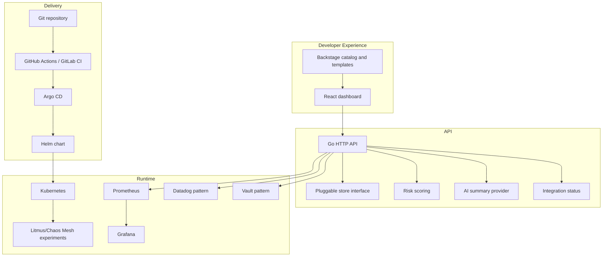
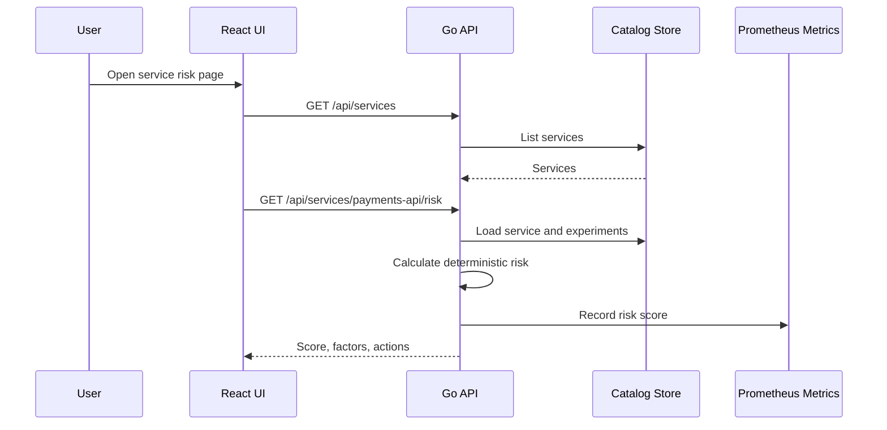

# Architecture

Platform Chaos Reliability Hub is a compact platform service around GitOps-managed chaos experiments.

## Design Choices

- The backend uses local in-memory sample data by default so the demo needs no database.
- The store is an interface so SQLite, Postgres or a catalog service can be added later.
- Risk scoring is deterministic and explainable rather than opaque.
- AI summaries are local and deterministic by default, with OpenAI-compatible configuration placeholders.
- Backstage is the intended single entry point, but the React UI can run standalone.

## Request Flow

